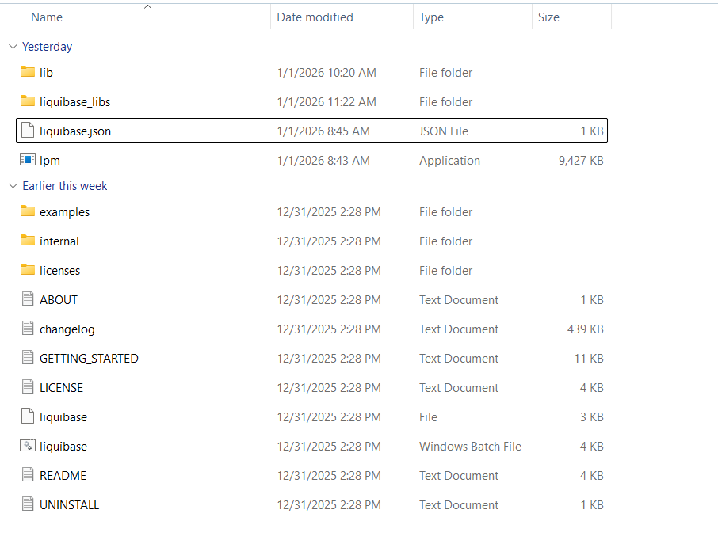
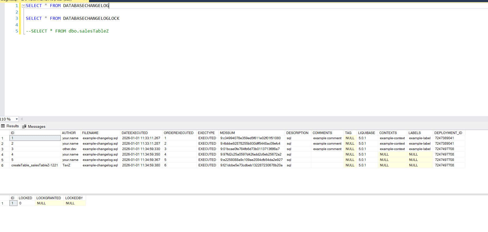

# Liquibase

A database tool, which can be used to automate database deployments across various vendors thereby reducing human iterative work and saving time.

## How to Setup?

- Go to <https://www.liquibase.com/download-community> and download the archive files.
- Once downloaded and extracted, you can see following set of files.

- Add the files path in System Path variable.
- After doing so, you can verify that the setup is on the right path by typing `liquibase --help` command in command prompt.
- You will also need to store JDBC drivers to the database in `lib` folder and then add the Path to the Path system variable.

## Folders & Files

- You can navigate to the examples folder in the downloaded Liquibase files.
- There you can find sub-folders having various models. It provides you a mechanism where you can specify your changes in either of SQL, XML, YAML or JSON format.
- At the heart of Liquibase is a 'changelog' file which contains all the changes related to database to be executed.
- Refer to `liquibase.properties` file. It contains configuration related to default properties.
  
## Getting started.

- Liquibase provides a head start where you can start looking into what are the basic functionality without going into much of the configuration details.
- Navigate to examples folder or you can also keep this folder at any other location apart from your main setup files.

### Commands

- `liquibase init start-h2` : This will start an in-built H2 database server.
- `liquibase update-sql` : This outputs the sql liquibase will execute. Works like a preview where you get to see the script before it is executed.
- `liquibase update` : This will execute the command from the changelog file on to the configured database. When executed the first time creates 2 tables 'DatabaseChangeLog' and 'DatabaseChangeLogLock'
  

- #### Role Backs

  - 'rollback-to-date': Used to revert changes made to the database to a previous state based on a specified date and/or time.
    - Example: `liquibase --changelog-file=yourchangelog.xml rollback-to-date 20YY-05-01`
  - `rollback<tag>`: Used to revert changes made to the database based on a specified tag. Tags can be specified with command `liquibase tag version1`. The previous tag command marks the last row in 'DatabaseChangeLog' table.
    - Example: `liquibase --changelog-file=yourchangelog.xml rollback-sql version1`
  - rollback-count: Used to revert a specified number of changesets.
    - Example : `liquibase --changelog-file=yourchangelog.xml rollback-count 3`
  - Previewing of the changes to be executed upon roll back can be done by appending a '-sql' to the command. The system outputs the SQL on the console.
    - Example : `liquibase --changelog-file=yourchangelog.xml rollback-to-date-sql 20YY-05-01`
    - Example: `liquibase --changelog-file=yourchangelog.xml rollback-sql version1`
    - Example: `liquibase --changelog-file=yourchangelog.xml rollback-count-sql 3`

### Liquibase and the CI/CD Pipeline process

- Depending on the requirement Pipeline can be created to deploy database changes.
- Pipeline can contain the `liquibase update` command to directly deploy changes on the database server.
- It can also contain a cautious approach where we can use the `liquibase update-sql` command and write the output to an SQL file which can be executed by the deployment team manually.
- For automated deployment, it is require that the changelog file resides in a source control repository where application code resides.
- We can have a single root changelog file which will reference various other change log files. This way multiple changes from other developers can be included.
  - Example:
        
